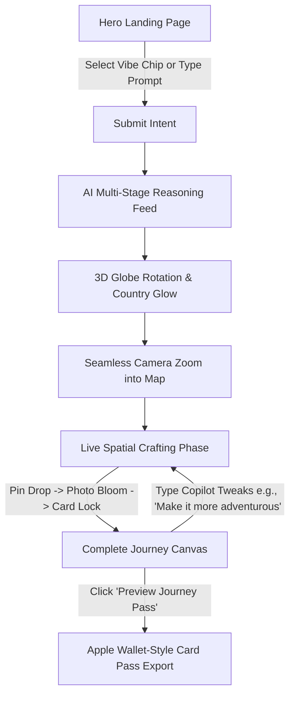

# Product Bible & Blueprint: AI Travel Intelligence Platform

> **North Star:** *"Travel isn't planned. It's crafted."*

---

## 1. Product Vision
The AI Travel Intelligence Platform reimagines travel discovery by replacing overwhelming forms, filters, and spreadsheets with a cinematic, narrative-driven spatial experience. It combines high-end visual storytelling, dynamic WebGL environmental illumination, live spatial camera tracking, and continuous natural language copilot refinement to create an emotional, unforgettable journey from the very first second.

---

## 2. Core Design Principles

### 🍏 1. Spatial Clarity & Whitespace (Inspired by Apple)
- Eliminate UI clutter. Every element must earn its place through purpose.
- Ample negative space, high contrast, and pristine typography hierarchy.
- Content takes center stage; interface elements act as subtle glass overlays.

### 🧠 2. Conversational Intelligence & Speed (Inspired by OpenAI)
- Instant feedback loops. AI thinking state is transparent, humanized, and continuous.
- No form controls or dry drop-down lists; interaction happens via natural language and tactile vibe chips.

### ⚙️ 3. Micro-Frictionless Polish & Motion Physics (Inspired by Linear)
- Smooth spring animations (`stiffness: 180, damping: 24`).
- Zero layout jank. Every element morphs and responds smoothly to user intent.

### 🎭 4. Atmospheric Immersive Storytelling (Inspired by Awwwards)
- Environmental illumination adaptivity: background mood dynamically reflects destination lighting (e.g. Tokyo Blue Dusk, Swiss Crisp Frost, Paris Golden Hour) without compromising the obsidian glass UI.
- Synchronized camera tracking that flies across terrain as the itinerary builds live.

---

## 3. Emotional Journey

| Stage | Name | Key Interface Event | Target Emotion |
| :--- | :--- | :--- | :--- |
| **01** | **Wonder** | Ultra-realistic mountain landscape, glowing headline, effortless prompt pill inspiration | Intrigued, calm, inspired |
| **02** | **Anticipation** | Semi-transparent 3D Globe rotating, destination glowing, multi-step AI reasoning feed | Excited, captivated |
| **03** | **Awe** | Globe zooms into map canvas, pin drops, photos bloom, camera flies, route pulses, Day cards lock live | Mesmerized, empowered |
| **04** | **Mastery** | Complete journey overview, spatial HUD metrics, continuous natural language copilot refinement | In control, ready to explore |

---

## 4. User Personas

### 1. The Aesthetic Explorer (Primary)
- **Profile:** Value-driven, design-conscious traveler seeking memorable and unique experiences.
- **Pain Point:** Exhausted by endless tabs on booking websites and generic "top 10" listicles.
- **Goal:** Wants an curated, atmospheric travel plan crafted effortlessly.

### 2. The High-Efficiency Executive
- **Profile:** Busy professional with limited planning time but high standards for luxury & local authenticity.
- **Pain Point:** Hates spending 10+ hours organizing logistics and matching flight/hotel schedules.
- **Goal:** Wants a complete 7-day optimized itinerary generated in under 30 seconds.

### 3. The Budget Luxury Planner
- **Profile:** Smart traveler maximizing experience within strict financial limits (e.g., "7 days in Japan under ₹60,000").
- **Pain Point:** Hard to gauge real total costs across stays, food, transport, and entry tickets.
- **Goal:** Needs real-time transparent budget tracking baked directly into the itinerary.

---

## 5. User Flow



---

## 6. Information Architecture

```
[Viewport Root]
├── [Layer 0: Environmental Lighting & Background Engine]
│   ├── Dynamic Ambient Canvas (WebGL / Gradient Mesh)
│   └── Destination Atmospheric Illumination Shaders
├── [Layer 1: Spatial Map & Globe Canvas]
│   ├── Interactive 3D Globe (Pre-generation)
│   ├── Geolocation Pin & Route Renderer (Post-zoom)
│   └── Camera Flight Manager
└── [Layer 2: Glass Glassmorphism UI Overlay]
    ├── Floating Top Header (Brand Logo, Sound Toggle, Save Pass)
    ├── Hero Stage (Prompt Input, Vibe Pills, Cinematic Headline)
    ├── Reasoning Feed (Live AI Thoughts & Status Indicators)
    ├── Storyline Drawer / Side Panel (Day-by-Day Crafting Timeline)
    ├── Floating Spatial HUD (Budget Health, Best Travel Window)
    └── Conversational Copilot Dock (Bottom Prompt Refinement Bar)
```

---

## 7. Complete Page Hierarchy

### 1. Hero State (`/`)
- **Header:** Minimal translucent top bar with logo, soundscape toggle, and "Explore Saved Journeys".
- **Center Canvas:** Cinematic headline ("Travel isn't planned. It's crafted.") + Glass prompt bar with micro-shimmer focus ring.
- **Vibe Presets:** Floating glass capsules offering pre-loaded luxury prompts.

### 2. Crafting State (Active Generation)
- **Background:** Ambient lighting adapts to destination mood.
- **Map Viewport:** Camera tracking follows active route pins in real time.
- **Timeline Panel:** Live Day Cards locking into place sequentially with audio tick feedback.

### 3. Canvas Master View (Post-Crafting)
- **Spatial HUD:** Displays live budget total (`₹58,400 / ₹60,000`), flight duration snapshot, and season score.
- **Copilot Bar:** Sticky bottom glass dock with quick refinement pills + custom text box.
- **Journey Pass Drawer:** Slide-over modal rendering a high-end luxury ticket pass for export.

---

## 8. Component Library

1. `GlassCard`: High-blur container with subtle white border gradient (`backdrop-filter: blur(20px)`).
2. `SpatialMap`: Canvas / WebGL engine supporting camera flight paths, glow pins, and animated SVG routes.
3. `GlobeEngine`: 3D rotating globe with country highlighting shaders.
4. `PromptInput`: Interactive auto-expanding text box with glowing submit trigger and typewriter insertion support.
5. `VibeChip`: Tactile button pill with dynamic hover elevation and icon micro-animations.
6. `ReasoningFeed`: Multi-stage pulse status indicator showing active AI processing steps.
7. `DayTimelineNode`: Sequential day card featuring hero photo, hotel pill, activity tags, and flight route link.
8. `SpatialHUD`: Floating glass metric bar detailing cost health, weather, and travel duration.
9. `CopilotDock`: Bottom natural language refinement bar.
10. `JourneyPassModal`: Skeuomorphic digital pass artifact for itinerary preview and PDF/Image export.

---

## 9. Design System

### Color Palette & Illumination Tokens

```css
/* Base Obsidian System */
--bg-obsidian: #08090C;
--surface-glass: rgba(18, 20, 28, 0.65);
--surface-glass-hover: rgba(26, 30, 42, 0.80);
--border-glass: rgba(255, 255, 255, 0.08);
--border-glass-accent: rgba(255, 255, 255, 0.18);

/* Typography Colors */
--text-primary: #F3F4F6;
--text-secondary: #9CA3AF;
--text-muted: #6B7280;
--text-accent: #60A5FA;

/* Atmospheric Environmental Lights (Dynamic Behind Glass) */
--env-tokyo: radial-gradient(circle at 50% 20%, rgba(37, 99, 235, 0.25), transparent 70%);
--env-switzerland: radial-gradient(circle at 50% 20%, rgba(186, 230, 253, 0.20), transparent 70%);
--env-paris: radial-gradient(circle at 50% 20%, rgba(251, 146, 60, 0.20), transparent 70%);
--env-iceland: radial-gradient(circle at 50% 20%, rgba(52, 211, 153, 0.20), transparent 70%);
--env-amalfi: radial-gradient(circle at 50% 20%, rgba(244, 114, 182, 0.20), transparent 70%);
```

### Typography Scale
- **Display Title:** `Inter` / `Outfit` - 64px (Desktop) | 38px (Mobile) - Weight: 700 - Letter spacing: `-0.03em`
- **Section Heading:** 24px - Weight: 600 - Letter spacing: `-0.01em`
- **Body / Itinerary:** 15px - Weight: 400 - Line height: `1.6`
- **Caption / HUD Metrics:** 12px Mono - Weight: 500 - Letter spacing: `0.05em`

### Glassmorphism & Elevation
- **Glass Panel:** `background: var(--surface-glass); backdrop-filter: blur(24px) saturate(180%); border: 1px solid var(--border-glass); box-shadow: 0 30px 60px -12px rgba(0, 0, 0, 0.5);`
- **Card Border Radius:** `20px` (Main Containers), `9999px` (Pills & Chips).

---

## 10. Motion System

### Spring Physics Specs
- **Default Fluid Spring:** `mass: 1, stiffness: 180, damping: 24`
- **Tactile Click Spring:** `mass: 0.5, stiffness: 300, damping: 15`
- **Spatial Camera Pan Easing:** `cubic-bezier(0.16, 1, 0.3, 1)` (Duration: 1400ms)

### Sequential Crafting Timeline Timing
1. `0ms`: User clicks submit. Globe rotates & country highlights.
2. `800ms`: Multi-stage Reasoning Feed pulses (`"Checking weather...", "Finding flights..."`).
3. `1800ms`: Globe zooms into 2D/3D map canvas.
4. `2600ms - Day 1`: Camera glides to Geolocation 1 -> Pin drops -> Photo blooms -> Day 1 Card locks in.
5. `3800ms - Day 2`: Camera glides to Geolocation 2 -> Route line draws -> Day 2 Card locks in.
6. `[Continues until final day]` -> Spatial HUD fades in.

---

## 11. Interaction Principles
- **Zero-Form Policy:** No dry select menus or multi-step wizard screens.
- **Conversational Continuity:** The user can command the AI at any time to modify the active state without losing map context.
- **Direct Spatial Mapping:** Hovering a timeline card highlights its corresponding node on the map and brings it into focus.
- **Acoustic Haptics:** Subtle ambient audio feedback for key UI actions (toggleable).

---

## 12. Responsive Strategy

### Desktop Viewport (>= 1024px)
- **Split Canvas:** Left 40% dedicated to narrative timeline & copilot dock; Right 60% dedicated to spatial map viewport.
- Full glass blur effects and high-FPS WebGL shader rendering.

### Mobile Viewport (< 1024px)
- **Full-Bleed Map + Glass Sheet:** Spatial map occupies 100% of background.
- **Bottom Glass Drawer:** Itinerary cards live inside a draggable glass bottom sheet with 3 snap points (Collapsed HUD, Half Story, Full Focus).
- Touch-friendly haptic controls and reduced shader complexity for maximum battery & frame-rate optimization.

---

## 13. Accessibility Principles
- **WCAG AA Compliance:** Text contrast ratios guaranteed against dark glass backgrounds (`#F3F4F6` on translucent obsidian).
- **ARIA Live Regions:** AI status updates ("Checking flights...", "Crafting Day 3...") announced seamlessly to screen readers.
- **Prefers-Reduced-Motion:** Disables dramatic camera flyovers and replaces with smooth 200ms cross-fades when motion reduction is requested by the OS.
- **Keyboard Navigation:** Full tab accessibility across all vibe pills, timeline cards, and copilot controls.

---

## 14. Technical Architecture

```
[React 18 + Vite]
├── Core Components (UI overlays, Glass panels, Timelines)
├── [State Management: Zustand / React Context]
│   ├── JourneyState (Active Itinerary, Current Day, Prompt)
│   ├── MapCameraState (Latitude, Longitude, Zoom Level, Target Pin)
│   ├── EnvironmentState (Destination Theme, Lighting Mode)
│   └── SoundState (Ambient Mute/Play, Haptic Feedback Trigger)
├── [Graphics & Engine Layer]
│   ├── Three.js / WebGL / Canvas (Interactive Globe & Terrain Shaders)
│   └── Map Engine / Animated SVG Routes (Geospatial Pin Tracking)
├── [Motion Layer]
│   └── Framer Motion / Custom Spring Hooks (Live Card Lock Animations)
└── [Audio Manager]
    └── Web Audio Synthesizer (Ambient soundscape & UI acoustic ticks)
```

---

## 15. Development Roadmap

### Phase 1: Core Foundation & Design System (Step 1)
- Setup Vite + React codebase structure with obsidian glass CSS tokens.
- Build high-blur `GlassCard`, `PromptInput`, and `VibeChip` UI components.

### Phase 2: Hero Stage & Atmospheric Engine (Step 2)
- Build hero section with mountain background, cinematic text reveal, and interactive vibe prompt pills.
- Implement multi-stage AI Reasoning Feed component.

### Phase 3: Interactive Globe & Spatial Map Canvas (Step 3)
- Build 3D globe rotation & country glowing shaders.
- Build spatial map canvas with smooth camera flight pan/zoom hooks.

### Phase 4: Live Spatial Crafting Engine & Copilot Dock (Step 4)
- Construct sequential day-by-day reveal engine (Pin drop -> Photo bloom -> Card lock).
- Integrate bottom copilot dock for real-time natural language itinerary refinements ("Make it more adventurous", "Reduce budget").

### Phase 5: Spatial HUD, Journey Pass Export & Final Polish (Step 5)
- Build floating Spatial HUD with real-time budget health metrics.
- Build luxury Apple Wallet-style Journey Pass modal with export triggers.
- Implement ambient audio soundscape & haptic toggle system.
- Perform high-FPS performance audit across desktop and mobile.
